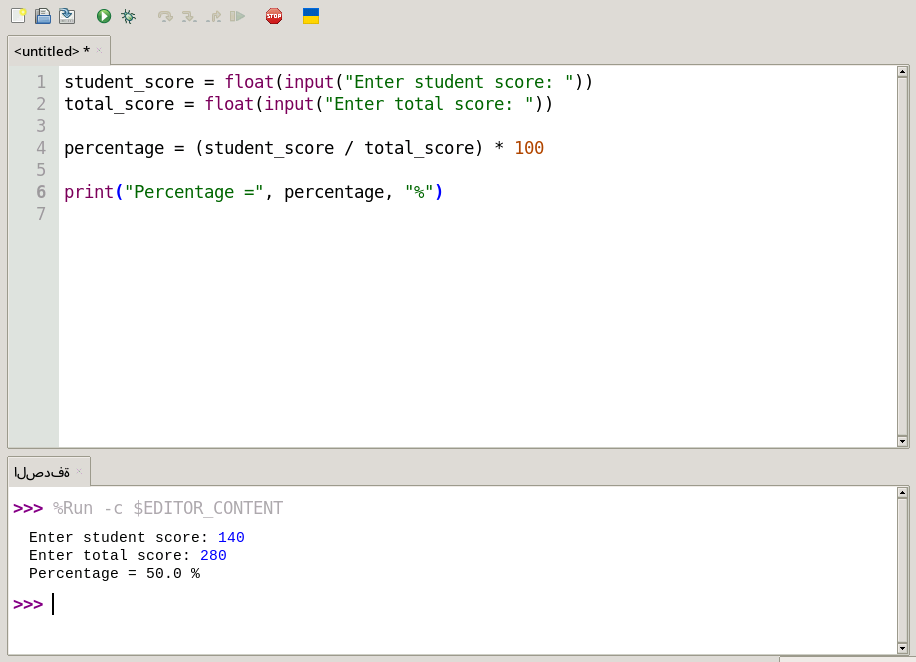

# Percentage Calculator

A simple Python program to calculate a student's percentage based on the obtained score and total score.

## Features

- Calculate a student's percentage.
- Accepts the student's score and total score.
- Simple command-line interface.
- Beginner-friendly Python code.

## How to Run

```bash
python percentage_calculator.py
```

## Example

```
Enter student score: 240
Enter total score: 280

Percentage = 85.71428571428571 %
```

## Screenshot



## License

MIT License
